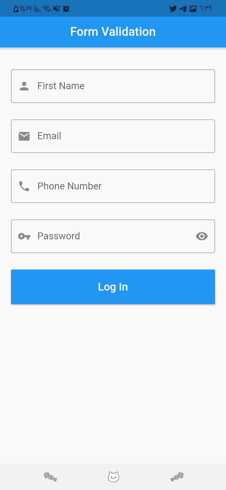
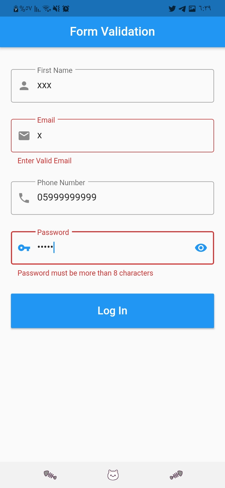

# Form Validation

A Flutter project that demonstrates auto validation of form.

## Getting Started

This project is a starting point for a Flutter application.

A few resources to get you started if this is your first Flutter project

## Getting Started

For help getting started with Flutter, view our
[online documentation](https://flutter.dev/docs), which offers tutorials,
samples, guidance on mobile development, and a full API reference.

## calcultour_flutter

<table>
  <td>
    

      
    

  </td>
  <td>
    

      
    

  </td>

</table>

